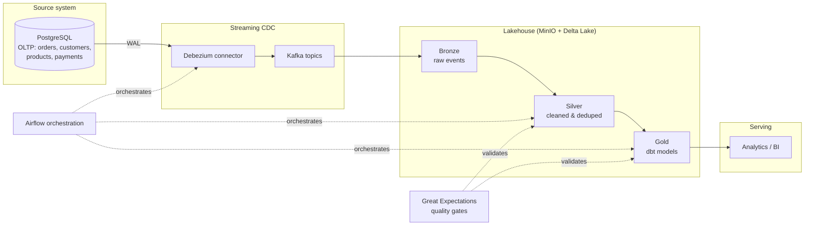
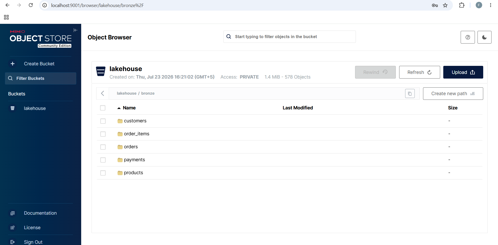
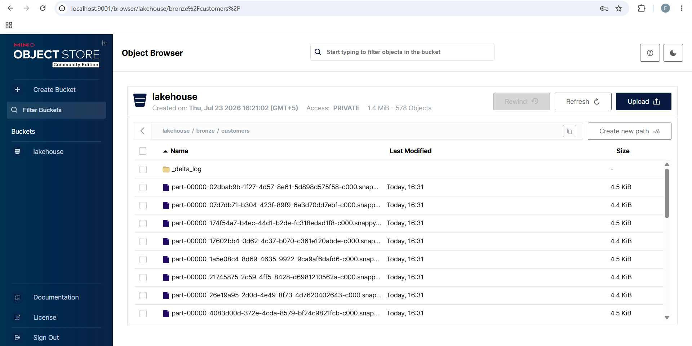

# E-Commerce CDC Lakehouse Platform

A production-style data engineering platform that captures live changes from
an OLTP e-commerce database via Change Data Capture (CDC), streams them
through Kafka, lands them in a Delta Lake medallion lakehouse
(bronze/silver/gold), transforms them with dbt, and orchestrates the
whole thing with Airflow -- deployed on Kubernetes via a Jenkins CI/CD pipeline.

## Architecture

## Tech stack

| Layer | Tool |
|---|---|
| Source DB | PostgreSQL (logical replication enabled) |
| CDC | Debezium |
| Streaming | Apache Kafka |
| Object storage / Lake | MinIO + Delta Lake |
| Transformation | dbt-core |
| Orchestration | Apache Airflow |
| Data quality | Great Expectations |
| Deployment | Docker, Kubernetes (Minikube) |
| CI/CD | Jenkins |
| Monitoring | Prometheus + Grafana |

## Roadmap

- [x] Phase 1 -- Foundation: OLTP schema, Postgres, traffic generator
- [x] Phase 2 -- CDC: Debezium + Kafka
- [x] Phase 3 -- Lakehouse: MinIO + Delta Lake
- [x] Phase 4 -- Transform: dbt models
- [ ] Phase 5 -- Orchestration: Airflow + Great Expectations
- [ ] Phase 6 -- Deployment: Kubernetes + Jenkins
- [ ] Phase 7 -- Observability: Prometheus + Grafana

## Run locally

\`\`\`bash
cd docker
docker compose up -d
cd ..
python -m venv venv
source venv/Scripts/activate
pip install -r requirements.txt
python scripts/generate_traffic.py --mode seed
python scripts/generate_traffic.py --mode stream --interval 2
\`\`\`

## Troubleshooting log

Real issues hit while building this, kept here because debugging distributed
systems is half the actual skill this project demonstrates.

**Postgres password auth failure after restart**
Cause: a stale Docker volume from an earlier experiment held old credentials
that didn't match the compose file. Fix: `docker compose down -v` to wipe the
volume and force a clean re-init.

**Port 5432 conflict**
Cause: a native Windows Postgres/pgAdmin install was already bound to 5432,
silently intercepting connections meant for the container. Fix: remapped the
container to host port `5433` in `docker-compose.yml`.

**Kafka Connect couldn't resolve `kafka:9092` from the host**
Cause: Kafka only advertised its internal Docker-network hostname. Fix: added
a second `EXTERNAL` listener on port `29092` specifically for clients running
outside Docker (e.g. the Python consumer on Windows).

**Kafka crashed with `NodeExistsException` from Zookeeper**
Cause: Kafka was killed abruptly in an earlier session and never
deregistered its broker ID from Zookeeper, which kept running and holding
stale state. Fix: full `docker compose down -v` to reset Zookeeper too.

**`ModuleNotFoundError: pyarrow` / `'dict' object has no attribute 'schema'`**
Cause: the `deltalake` Python library's write API expects a pandas
DataFrame or PyArrow table, not a raw list of dicts, and needs `pyarrow`
installed as a backing dependency. Fix: convert buffered rows to a
DataFrame before calling `write_deltalake`, and `pip install pyarrow`.

**`OSError: ... Only one usage of each socket address ... (os error 10048)`**
Cause: Debezium's initial snapshot fires dozens of CDC events within
milliseconds, and a small `BATCH_SIZE` caused the consumer to open a new
MinIO connection on almost every message, exhausting available Windows
ports faster than they could be released. Fix: increased batch size so
writes happen far less frequently, reducing connection churn.

## Screenshots

**Bronze layer in MinIO — Delta tables per source table**

**Live CDC events from Kafka**

**Numeric columns arrived as base64-encoded garbage (e.g. `'Xf8='`) instead of numbers**
Cause: Debezium's default Postgres connector behavior encodes `NUMERIC`
columns as raw bytes, which then serialize to base64 strings in JSON.
Fix: added `"decimal.handling.mode": "double"` to the Debezium connector
config, so numeric fields come through as plain doubles.

**Kafka repeatedly failing to restart after laptop sleep/shutdown with `NodeExistsException`**
Cause: Zookeeper retains broker registration state across ungraceful
shutdowns, and Kafka refuses to start with a duplicate broker ID. Fix:
full `docker compose down -v && docker compose up -d` to reset all
state cleanly. Longer-term fix: always run `docker compose down`
(without `-v`) before shutting down the machine, to let Kafka
deregister gracefully.
