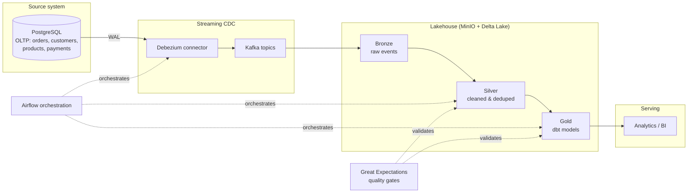

# E-Commerce CDC Lakehouse Platform

A production-style data engineering platform that captures live changes from
an OLTP e-commerce database via Change Data Capture (CDC), streams them
through Kafka, lands them in a Delta Lake medallion lakehouse
(bronze/silver/gold), transforms them with dbt, and orchestrates the
whole thing with Airflow -- deployed on Kubernetes via a Jenkins CI/CD pipeline.

## Architecture

## Tech stack

| Layer | Tool |
|---|---|
| Source DB | PostgreSQL (logical replication enabled) |
| CDC | Debezium |
| Streaming | Apache Kafka |
| Object storage / Lake | MinIO + Delta Lake |
| Transformation | dbt-core |
| Orchestration | Apache Airflow |
| Data quality | Great Expectations |
| Deployment | Docker, Kubernetes (Minikube) |
| CI/CD | Jenkins |
| Monitoring | Prometheus + Grafana |

## Roadmap

- [x] Phase 1 -- Foundation: OLTP schema, Postgres, traffic generator
- [x] Phase 2 -- CDC: Debezium + Kafka
- [ ] Phase 3 -- Lakehouse: MinIO + Delta Lake
- [ ] Phase 4 -- Transform: dbt models
- [ ] Phase 5 -- Orchestration: Airflow + Great Expectations
- [ ] Phase 6 -- Deployment: Kubernetes + Jenkins
- [ ] Phase 7 -- Observability: Prometheus + Grafana

## Run locally

\`\`\`bash
cd docker
docker compose up -d
cd ..
python -m venv venv
source venv/Scripts/activate
pip install -r requirements.txt
python scripts/generate_traffic.py --mode seed
python scripts/generate_traffic.py --mode stream --interval 2
\`\`\`
